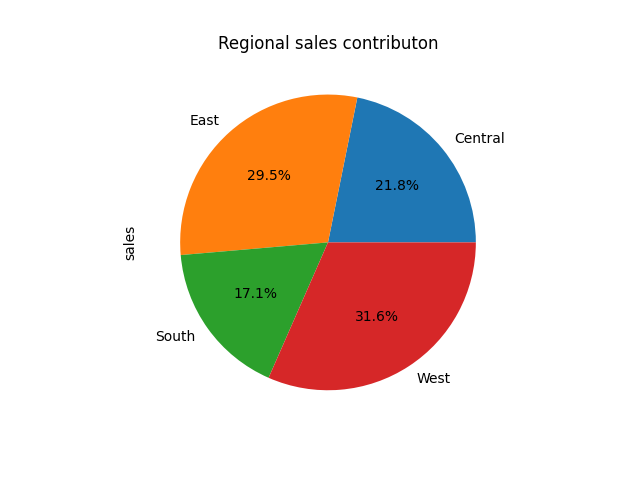

# Retail Sales Data Analysis (SQL + Python)

This project analyzes a retail sales dataset containing **9,994 transactions** to uncover business insights using **PostgreSQL and Python**.

## Tools Used
- PostgreSQL
- Python
- Pandas
- Matplotlib
- Seaborn
- Google Colab
- GitHub

## Dataset
Superstore retail dataset including:
- Order ID
- Order Date
- Category
- Region
- Sales
- Profit
- Quantity

Total Records: **9,994**

## SQL Analysis
The following SQL analyses were performed:

- Annual Sales Trend
- Monthly Sales Aggregation
- Regional Sales Contribution
- Category Profitability
- Yearly Sales Growth

SQL queries are available in the **/sql** folder.

## Python Analysis
Using Python and Pandas:

- Data cleaning
- Sales trend analysis
- Profitability analysis
- Correlation analysis
- Customer segment analysis

Python notebook is available in **/python** folder.

## Visualizations

### Yearly Sales Trend

### Monthly Sales Trend

### Regional Sales Contribution

### Profit Margin by Category

### Sales vs Profit by Category

## Key Insights

- Sales increased from **$484K in 2014** to **$733K in 2017**
- **West region contributes the highest revenue (~31%)**
- **Technology category has the highest profit margin**
- **Furniture category shows the lowest profitability**

## Project Structure
# Retail Sales Data Analysis (SQL + Python)

This project analyzes a retail sales dataset containing **9,994 transactions** to uncover business insights using **PostgreSQL and Python**.

## Tools Used
- PostgreSQL
- Python
- Pandas
- Matplotlib
- Seaborn
- Google Colab
- GitHub

## Dataset
Superstore retail dataset including:
- Order ID
- Order Date
- Category
- Region
- Sales
- Profit
- Quantity

Total Records: **9,994**

## SQL Analysis
The following SQL analyses were performed:

- Annual Sales Trend
- Monthly Sales Aggregation
- Regional Sales Contribution
- Category Profitability
- Yearly Sales Growth

SQL queries are available in the **/sql** folder.

## Python Analysis
Using Python and Pandas:

- Data cleaning
- Sales trend analysis
- Profitability analysis
- Correlation analysis
- Customer segment analysis

Python notebook is available in **/python** folder.

## Visualizations

### Yearly Sales Trend

### Monthly Sales Trend

### Regional Sales Contribution

### Profit Margin by Category

### Sales vs Profit by Category

## Key Insights

- Sales increased from **$484K in 2014** to **$733K in 2017**
- **West region contributes the highest revenue (~31%)**
- **Technology category has the highest profit margin**
- **Furniture category shows the lowest profitability**

## Project Structure
retail-sales-data-analysis
│
├── dataset
├── sql
├── python
├── visualizations
└── README.md

##Author
Roshni Tiwari
